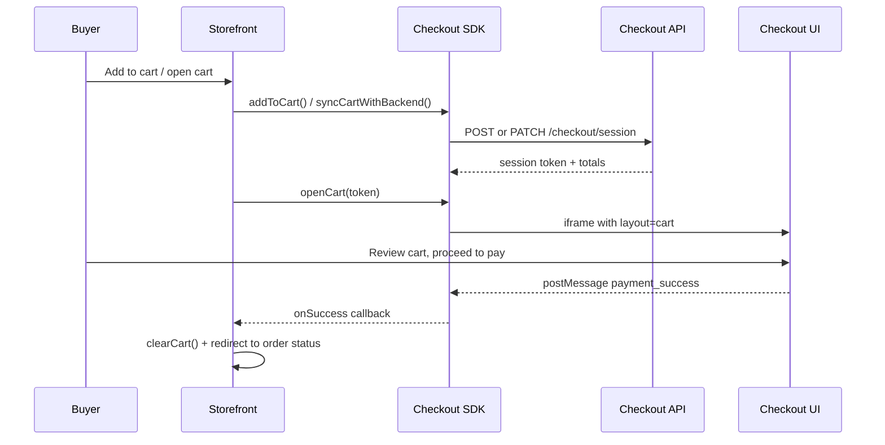

# Mega Checkout — Storefront Implementation Plan

Step-by-step plan to integrate Mega Checkout into a merchant storefront. Adapt file paths and patterns to match the target project (Next.js, Vite SPA, etc.).

---

## 1. Architecture

| Component | Responsibility |
|-----------|----------------|
| **Merchant storefront** | Product browsing, add-to-cart, open checkout |
| **Checkout SDK** (`checkout.js` CDN) | Cart persistence, session sync, iframe UI |
| **Checkout API** | `POST/PATCH /checkout/session`, payments |
| **Checkout UI** | Embedded cart drawer + full checkout (iframe) |



**Reference implementation:** `demo-store/` (CDN + `openCart` slide-out drawer).

---

## 2. Prerequisites

Before starting, confirm you have:

- [ ] Merchant **public key** (`mk_public_...`)
- [ ] Merchant **secret key** (`mk_secret_...`)
- [ ] **Store ID** (UUID)
- [ ] **Checkout API** base URL (e.g. `http://localhost:3000/api` or production)
- [ ] **Checkout UI** URL (e.g. `http://localhost:5174` or production)
- [ ] CDN script URL: `https://app-checkout-bhagvatprasadam.megascale.co.in/v1/checkout.js`

Local dev services:

| Service | Typical port |
|---------|--------------|
| Checkout API | 3000 |
| Checkout UI | 5174 |
| Storefront | project default (demo-store uses 5175) |

---

## 3. Implementation Steps

### Step 1 — Load the SDK script

Add the CDN script to the app entry point:

| Framework | Where to add |
|-----------|--------------|
| Vite / CRA | `index.html` before `</body>` |
| Next.js App Router | `layout.js` via `next/script` |

```html
<script src="https://app-checkout-bhagvatprasadam.megascale.co.in/v1/checkout.js"></script>
```

---

### Step 2 — Create checkout config module

Create `src/lib/checkout.js` or `src/lib/checkout.ts` (match project convention).

**Exports required:**

| Export | Purpose |
|--------|---------|
| `CHECKOUT_PUBLIC_KEY` | Passed to checkout UI iframe |
| `CHECKOUT_SECRET_KEY` | `x-api-key` for session/cart APIs |
| `CHECKOUT_STORE_ID` | Cart cookie namespace |
| `CHECKOUT_API_BASE` | Backend API root |
| `CHECKOUT_UI_URL` | Checkout UI origin |
| `buildOrderSuccessUrl(token)` | Post-payment redirect URL |
| `getCheckoutSDK()` | Lazy, SSR-safe SDK singleton |

**Init config:**

```js
window.CheckoutSDK.init({
  publicKey: CHECKOUT_PUBLIC_KEY,
  secretKey: CHECKOUT_SECRET_KEY,
  storeId: CHECKOUT_STORE_ID,
  baseUrl: CHECKOUT_API_BASE,
  checkoutUrl: CHECKOUT_UI_URL,
});
```

**Rules:**

- Use `getCheckoutSDK()` everywhere — never top-level `window` access in SSR projects.
- Never put `secretKey` in iframe URLs; only `publicKey` goes to checkout UI.

---

### Step 3 — Cart context (SDK as source of truth)

Create or refactor a `CartProvider` so React state mirrors the SDK cart.

| Action | SDK method |
|--------|------------|
| Hydrate on mount | `sdk.getCartItems()` |
| Listen for changes | `sdk.on('cart_updated', ...)` |
| Add item | `sdk.addToCart(item)` |
| Remove item | `sdk.removeFromCart(id)` |
| Update qty | `sdk.updateQuantity(id, qty)` |
| Clear | `sdk.clearCart()` |

Wrap the app at the highest level that includes Header and product pages (e.g. `main.tsx` or root `layout.js`).

---

### Step 4 — Product → cart item mapper

Write a store-specific mapper from your product model to the SDK payload:

```js
{
  productId: string,       // required
  variantId: string,       // required
  title: string,
  variantTitle: string,
  price: number,           // rupees in storefront; SDK sends paise to API
  quantity: number,
  imageUrl: string,
  sku: string,
  weight: number,          // optional, per-unit kg
  weightUnit: 'kg',
}
```

Inspect how the target store represents products (Shopify edges, Mongo `_id`, plain `id`, etc.) and map accordingly.

---

### Step 5 — Wire checkout entry points

#### A. Header cart icon

```
syncCartWithBackend() → openCart(session.token, callbacks)
```

Use when the buyer clicks the bag/cart icon with items already in cart.

#### B. Product page “Add to cart”

```
addToCart(item) → openCart(session.token, callbacks)
```

Use when the buyer adds an item and should see the cart drawer immediately.

#### C. Optional centralized helper

If multiple components trigger checkout, extract one function (e.g. `openMegaCheckout()`) into cart context or a dedicated hook.

---

### Step 6 — Success and failure handling

**On success (`onSuccess` / `order_completed`):**

1. Call `clearCart()`.
2. Redirect to `data.statusUrl` if present, else `buildOrderSuccessUrl(data.sessionId)`.

**On failure (`onFailure`):**

- Show error via the project’s existing toast/alert pattern.
- Do not clear the cart.

Keep behavior consistent across header cart and product add-to-cart flows.

---

### Step 7 — Environment configuration

Use env vars where the project supports them:

| Variable | Notes |
|----------|-------|
| `CHECKOUT_PUBLIC_KEY` / `NEXT_PUBLIC_*` / `VITE_*` | Safe for client |
| `CHECKOUT_SECRET_KEY` | Prefer server-only in Next.js |
| `CHECKOUT_STORE_ID` | Client |
| `CHECKOUT_API_BASE` | Client |
| `CHECKOUT_UI_URL` | Client |

Swap localhost URLs for production when deploying.

---

## 4. What the SDK handles (do not rebuild)

| Feature | SDK method / behavior |
|---------|----------------------|
| Cart drawer UI | `openCart(token)` — slide-out iframe with `layout=cart` |
| Full checkout modal | `openCheckout(token)` — triggered via `open_checkout` postMessage |
| Cart persistence | Cookies (`checkout_cart_{storeId}`), 48h inactivity expiry |
| Session reuse | `syncCartWithBackend()` PATCHes existing session when possible |
| Iframe resize / loading | Built into SDK overlay |

**Do not:**

- Build a custom `CheckoutModal` unless explicitly required.
- Redirect with `window.location.href` to `/session/{token}` as the primary flow.
- Duplicate cart in `localStorage` when the SDK already persists it.
- Install `@checkout/sdk` npm package unless CDN is not an option.

---

## 5. Files to create or modify

| File | Action |
|------|--------|
| `index.html` or root `layout.js` | Add `checkout.js` script |
| `src/lib/checkout.js` | Config + `getCheckoutSDK()` |
| `src/context/CartContext.*` | SDK-backed cart provider |
| Header / cart component | `syncCartWithBackend` + `openCart` |
| Product page / add-to-cart | `addToCart` + `openCart` |
| Product mapper utility | `buildSdkItemFromProduct()` |

Optional (Next.js pattern):

| File | Action |
|------|--------|
| `src/context/CartSidebarContext.*` | Centralized `openCartDrawer()` helper |
| `src/components/CheckoutProviders.*` | Wrap `CartProvider` + sidebar context |

Reference examples in repo root: `client-checkout.lib.example.js`, `client-CartContext.example.jsx`, `client.file.txt`, `client-CheckoutProviders.example.jsx`.

---

## 6. Testing checklist

- [ ] `checkout.js` loads before any checkout action
- [ ] Add to cart updates header cart count
- [ ] Cart survives page refresh (SDK cookie)
- [ ] Cart icon opens SDK slide-out drawer
- [ ] Proceed to checkout inside drawer opens full checkout modal
- [ ] Successful payment clears cart and shows order status
- [ ] Failed payment shows error without clearing cart
- [ ] No `window is not defined` on SSR pages
- [ ] Prices correct in UI (rupees); API receives paise
- [ ] `productId` / `variantId` match backend catalog

---

## 7. Related docs in this repo

| Document | Use when |
|----------|----------|
| `CHECKOUT_INTEGRATION.md` | Overview of integration options |
| `CHECKOUT_EMBEDDED_SDK.md` | `openCheckout()` overlay details |
| `CHECKOUT_INTEGRATION_CDN.md` | CDN + hosted redirect (legacy) |
| `CHECKOUT_INTEGRATION_SDK.md` | npm package approach (not used in demo-store) |
| `CHECKOUT_IFRAME_INTEGRATION.md` | Manual iframe modal (superseded by SDK) |
| `STORE_NEXTJS_CHECKOUT_SETUP.md` | Next.js file map and exports |

---

## 8. demo-store quick reference

Current demo-store wiring:

```
index.html          → loads checkout.js CDN
src/lib/checkout.ts → keys, URLs, getCheckoutSDK()
src/context/CartContext.tsx → SDK-synced cart state
src/components/layout/Header.tsx → cart icon → syncCartWithBackend + openCart
src/pages/Product.tsx → addToCart + openCart
src/main.tsx        → CartProvider wrapper
```
